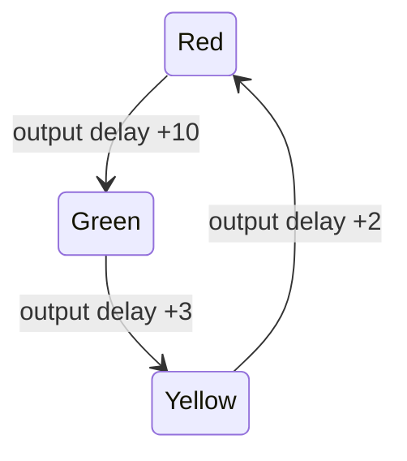

[**فارسی**](README.md) | [English](README.en.md)

# Timed traffic-light model

I started this traffic-light model in **CPN Tools** as a university exercise in timed Petri nets. I have shared the original model here, along with the parts that still need work.

**Status: incomplete model.**

## Inspect the source

Open [model/traffic-light.cpn](model/traffic-light.cpn) in a compatible CPN Tools environment. The file identifies its generator as CPN Tools 4.0.1. Check declarations and inscriptions before attempting simulation.

The `trafficlight` page contains three places, five transitions, and eight arcs. Its timed `STATE` colour set has `Green`, `Yellow`, and `Red`. One cycle has output token delays of 10, 3 and 2 model time units.

This diagram summarizes one cycle's inscriptions. Output-token delays are not automatically complete phase-duration specifications, and no mapping to seconds has been verified.

## Known limitations

- The vertical branch has only a green-to-yellow transition; its initial red marking cannot complete a cycle using the supplied branch.
- The `mainState`/`changecoller` portion needs review, including its bidirectional arc inscription.
- Mutual exclusion between conflicting directions has not been established.
- There is no saved simulation trace or state-space report.

## Remaining work

1. Check every arc's type and inscription in CPN Tools.
2. Define both directions and an explicit all-red clearance state.
3. Document time-unit meaning and initial marking.
4. Verify that conflicting greens are unreachable and test for deadlock.
5. Save simulation traces and state-space statistics before claiming correctness.

The file's XML structure has been checked, but CPN Tools simulation has **not been run** for this published version. I have kept the model unchanged from my original submission and documented the remaining checks above,it was created only for educational reasons and is not ready to lunch.
